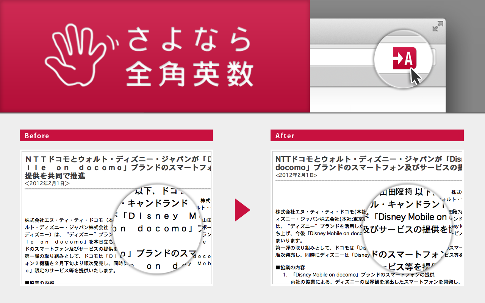
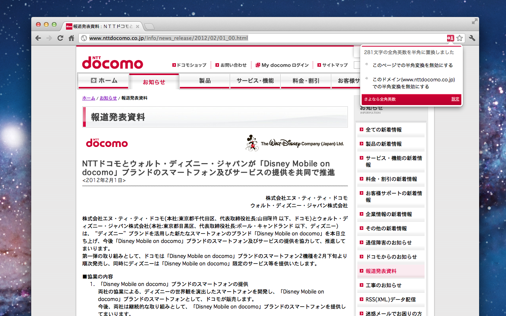
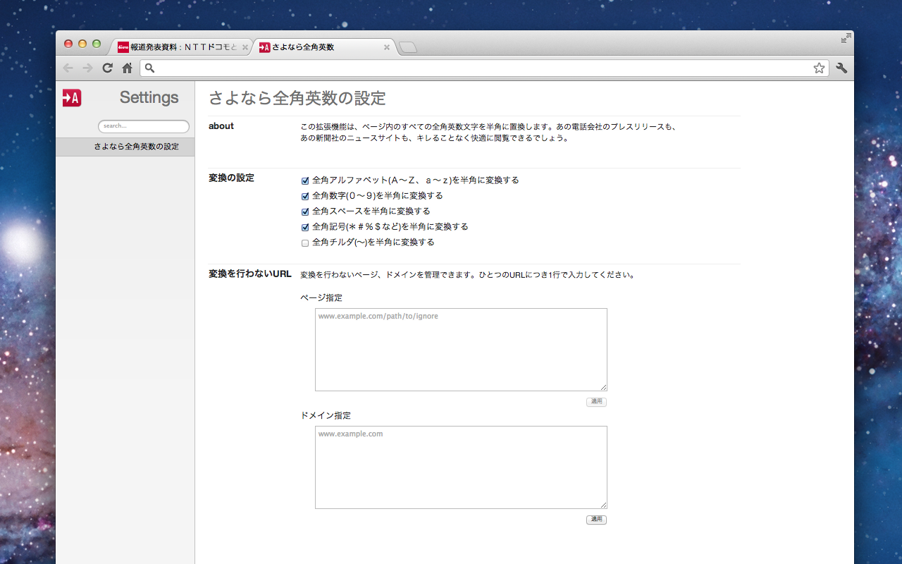

# (Welcome back!) goodbye "Zenkaku" - お帰り！さよなら全角英数

ページ内のすべての全角英数文字を半角に置換します。  
あの電話会社のプレスリリースも、あの新聞社のニュースサイトも、キレることなく快適に閲覧できるでしょう。  
(Manifest V3対応)

## 免責事項

本ソフトウェアを使用することによって、あるいは使用できないことによって発生した損失や損害に対して、[オリジナル版](https://chromewebstore.google.com/detail/mjdgifdhhligineaimmgbikndpifdgml)の作者様および本ソフトウェア作者(以後作者ら)は一切責任を負いません。  
ソフトウェアの入手および利用は、利用者の自己の責任と費用により行ってください。  
ユーザーは本ソフトウェアをダウンロードを以てこれに同意したとみなします。  
ソフトウェアが入手できないこと、入手中および入手することによって発生した損失や損害に対して作者らは一切責任を負いません。  
本ソフトウェアは、なんらの予告なく変更、配布の中止をすることがあります。  
作者らは、これらを原因として発生した損失や損害について一切責任を負いません。  

## 概要

かの邪知暴虐なるG○○gleにより我々から奪われた「さよなら全角英数」が、
AIネクロマンサー、Claude Codeの手によって帰ってきた！  
お帰り！さよなら全角英数！  
お別れしてんのか再会してんのかもう訳分かんねぇな。  
外面は何もかもをそのままに、動作できるようになりました。  
怒られたら直します。(主に元作者から。)  
でも、後継が無いってのも困るじゃろ。[別の](https://chromewebstore.google.com/detail/aankefgjeeabgbehpccgnfldgoilcime)はちと使い勝手が違うし。

なので、このとおり、特定サイト、指定ドメインでの機能停止機能もそのまま継承。

設定画面もそのまま継承。

## 作成後記

設定画面の移植が一番面倒でした。  
なにせWeb系はさっぱりわからん。  
普段Win32APIのちょっとしたラッパー、MFCと触れ合うプログラマなもんで。
